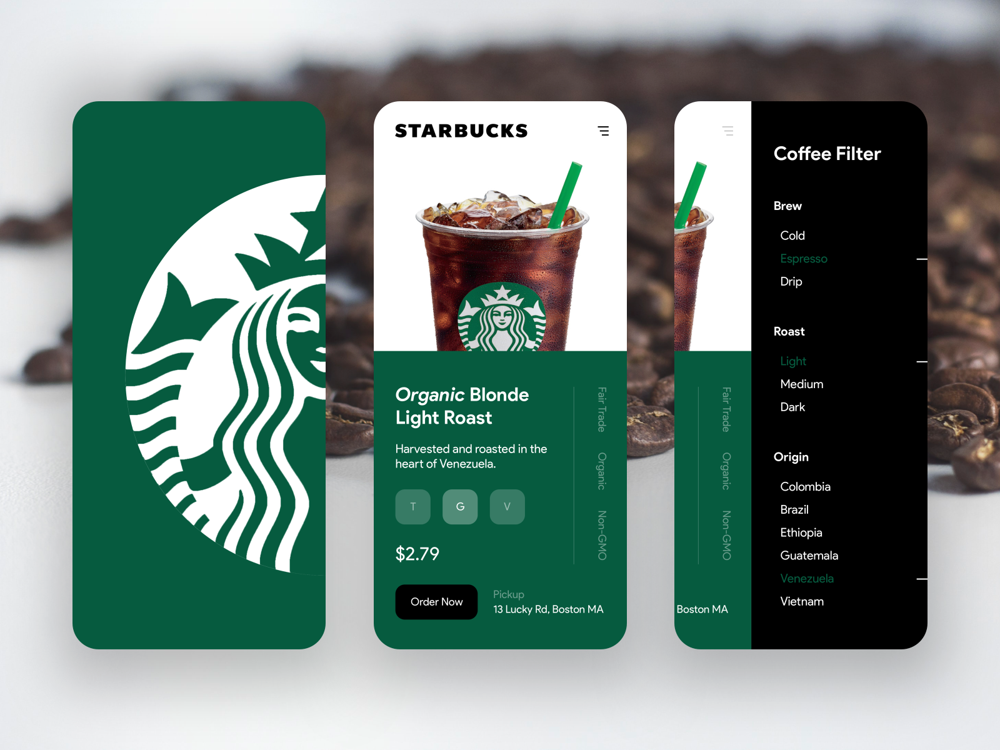

# Starbucks Capstone Challenge

## 1. Dependencies

- pandas
- numpy
- math
- json
- seaborn
- boto3
- os
- sagemaker
- matplotlib
- dateutil
- sklearn 
- plotly

## 2. Notebooks

- 1.Starbucks_Capstone_notebook-Data_Preprocessing.ipynb
	- Contains all the preprocessing steps, feature engineering and 
	upload preprocessed training and test data to Amazon S3.

- 2.Starbucks_Capstone_notebook-Training_an_Estimator.ipynb
	- Contains the training, evaluation, deployment and result steps.

## 3. Project description

The goal of this project consists  in  using  Amazon  SageMaker’s  supervised learning  model,  DeepAR,  to  predict  how  much someone will spend based in the next days. Knowing that information, it is possible to discover which demographic groups respond best to which offer type and create a recommendation system that suggests customized offers. According to DeepAR forecasting algorithm documentation, it is a method for finding time-based patterns and forecasting scalar (one-dimensional) time series using recurrent neural networks (RNN).

The  machine learning model which was used to predict how much a user will spend next day will  be  deployed  using  Amazon  SageMaker. To be consumed, the model will use a web-app that will allow a user pass his ID, using it as a trigger to Amazon API Gateway which will trigger a lambda function to preprocess the input data and send preprocessed input data to the model. The main tasks involved to create the recommendation system are the following:

1.  Exploring and cleaning the data;
2.  Choosing a model;
3.  Training an estimator that can predict how much someone will spent 
according to the offer received;
4.  Building an API using Amazon API Gateway and make the estimator run on 
a web-app;
5.  Make the web-app predicts a how much a user will spend in each offer to 
the next day.

This was the final project of the Machine Learning Engineer Nanodegree program by Udacity.
